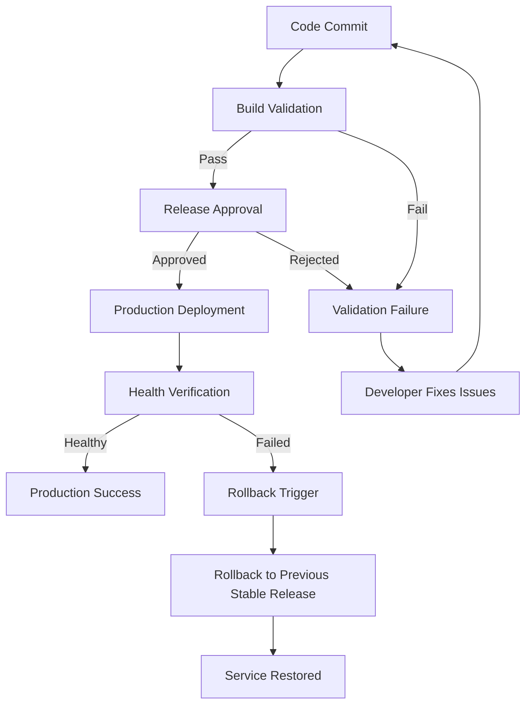

# Deployment Workflow Diagram

## Overview

The following diagram illustrates the controlled deployment workflow for the Checkout Service. It shows how a release progresses through validation, approval, deployment, health verification, and recovery.

---

## Deployment Workflow



---

## ASCII Workflow

```text
                 Code Commit
                      │
                      ▼
             Build Validation
              │            │
      Validation Pass   Validation Failure
              │            │
              ▼            ▼
       Release Approval   Fix Issues
              │
      Approved │ Rejected
              ▼
    Production Deployment
              │
              ▼
     Health Verification
        │             │
   Healthy        Health Check Failure
        │             │
        ▼             ▼
Production Success  Rollback Trigger
                          │
                          ▼
           Previous Stable Release
                          │
                          ▼
                 Service Restored
```

---

## Workflow Stages

1. **Code Commit** – Developers submit changes to the repository.
2. **Build Validation** – Build, testing, and validation checks are executed.
3. **Release Approval** – The Release Manager approves production deployment.
4. **Production Deployment** – The approved release is deployed to production.
5. **Health Verification** – Application health and monitoring are verified.
6. **Production Success** – Deployment is declared successful if all checks pass.
7. **Rollback Trigger** – Any deployment or health failure initiates recovery.
8. **Service Restored** – The previous stable version is restored and monitored.
